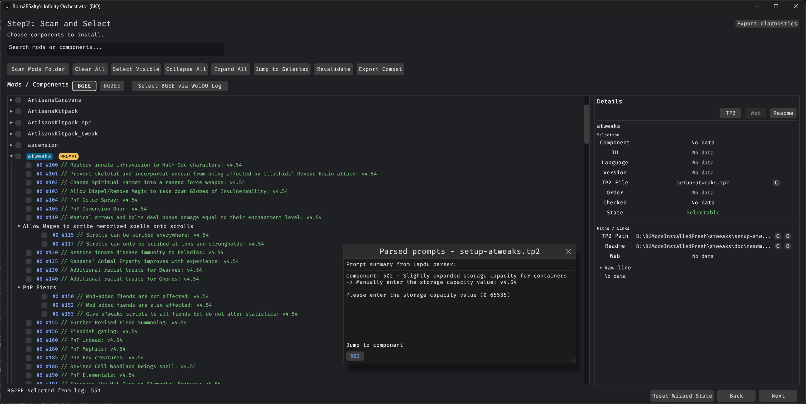
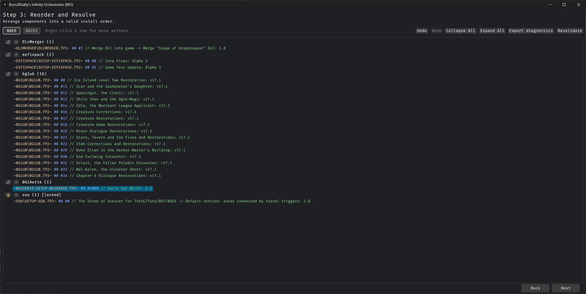
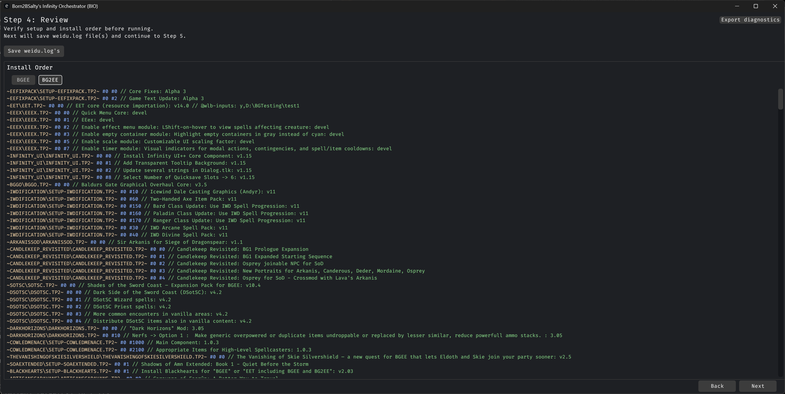
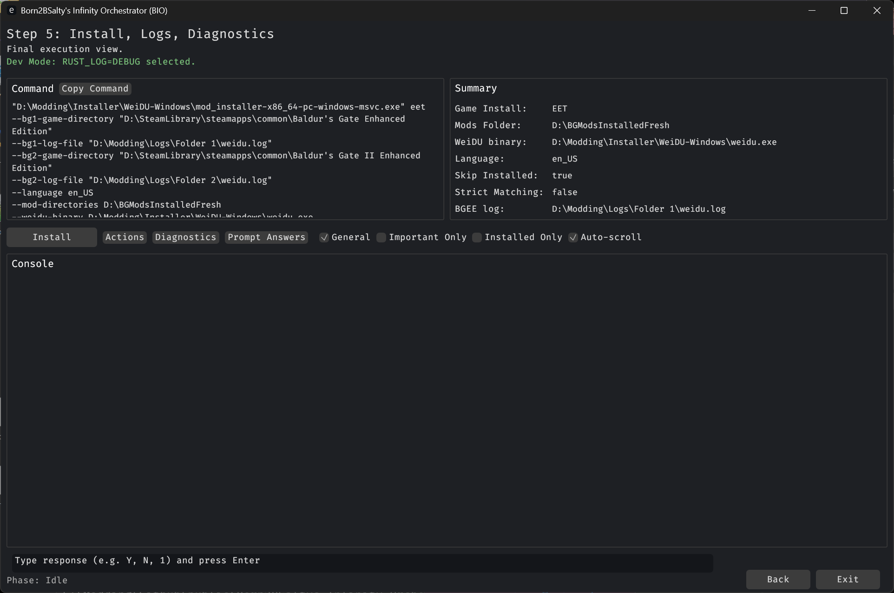

# Born2BSalty's Infinity Orchestrator (BIO)

BIO is a desktop wizard for WeiDU-based Infinity Engine EE installs.

Supported targets:
- BGEE
- BG2EE
- EET

BIO scans TP2 components, lets you select and reorder installs, validates compatibility, and runs mod_installer with live
console control.

## Quick Start (Normal Users)

1. Download the BIO release zip and extract it.
2. Launch BIO.exe.
3. In Step 1, set:
- your game mode (BGEE, BG2EE, or EET)
- your Mods Folder
- your weidu binary
- your mod_installer binary
- required game/log paths for your selected mode
4. Go to Step 2, click Scan Mods Folder, select components.
5. Go to Step 3, reorder if needed, click Revalidate.
6. Go to Step 4, review/save.
7. Go to Step 5, run install.

If you are helping debug issues, run BIO in dev mode:
- Windows cmd: BIO.exe -d gui
- Linux/macOS: ./BIO -d gui

## Wizard Overview

### Step 1: Setup
- Configure game mode, folders, binaries, and install flags.
- Configure optional behavior (scan depth, timeout, prompt settings, target prep).
- If Next is disabled, Step 1 validation found a required missing/invalid path.

### Step 2: Scan and Select
- Scan Mods Folder for TP2 components.
- Select components for install.
- Apply existing WeiDU log selections (if enabled).
- Review compatibility pills/details.

### Step 3: Reorder and Resolve
- Reorder selected components.
- Validate dependency/conflict/order/game-target rules against the chosen set.
- Resolve blockers before install.

### Step 4: Preview and Save
- Review final install order.
- Save/export effective WeiDU-log style output.

### Step 5: Install, Logs, Diagnostics
- Start install with live console.
- Manual prompt input + auto-answer support.
- Cancel/force cancel controls.
- Export diagnostics bundle.

## Core Features

### Scan and Selection
- Fast TP2 component scan.
- Search/filter and bulk selection.
- EET-friendly BGEE/BG2EE bucket workflow.
- Import selection from existing WeiDU logs.

### Compatibility Validation
- TP2-driven checks:
- dependency rules
- forbid/conflict rules
- game target predicates
- conditional patterns
- Step 2/Step 3 issue views with rule details.
- Optional rule overrides via step2_compat_rules.toml.

### Install + Console
- Embedded process console.
- Views: General, Important only, Installed only.
- Prompt detection and response flow.
- Optional auto-answer from:
- inline @wlb-inputs
- saved prompt answer memory
- Optional sound cue when manual input is needed.

### Diagnostics
- Export run diagnostics to diagnostics/run_<timestamp>/.
- Includes:
- bio_diag.txt
- compat_summary.json
- source WeiDU logs snapshot
- appdata snapshots (bio + mod_installer config)
- TP2 layout snapshot and validation summary

## Requirements

- Runtime target: Windows/Linux/macOS.
- For building from source: Rust stable + cargo.
- External tools configured in Step 1:
- mod_installer (.exe on Windows)
- weidu (.exe on Windows)

## Build and Run (Source Users)

Build:
cargo build --release

Run GUI:
./target/release/BIO.exe

Linux/macOS binary:
./target/release/BIO

Dev mode:
./target/release/BIO.exe -d gui

## @wlb-inputs Prompt Auto-Input

Append scripted answers on a WeiDU log line:

// @wlb-inputs: y,1,,n

Rules:
- answers are consumed left-to-right
- ,, means blank answer (press Enter)
- keep marker exact: @wlb-inputs:

Examples:

~EET\EET.TP2~ #0 #0 // EET core: v14.0 // @wlb-inputs: y
~EET\EET.TP2~ #0 #0 // EET core: v14.0 // @wlb-inputs: D:\My Games\BG2
~VIENXAY\VIENXAY.TP2~ #0 #0 // Vienxay: 1.67 // @wlb-inputs: 1,2

## Step 1 Flags (Practical)

- -s Skip installed
- -c Check last installed
- -a Abort on warnings
- -x Strict matching
- --download Download missing mods
- -o Overwrite mod folder

Directory clone modes:
- -p Clone BGEE -> Pre-EET target
- -n Clone BG2EE -> EET target
- -g Clone source game -> target directory

## Compatibility Semantics

Issue classes:
- Missing dependency (REQ_MISSING)
- Conflict (FORBID_HIT)
- Game mismatch (GAME_MISMATCH)
- Conditional patch (CONDITIONAL)
- Order warning (ORDER_WARN)

For EET:
- BGEE/BG2EE tabs are selection buckets/phases.
- Rules are validated in EET context where applicable.

## Diagnostics for Support

When reporting a problem:

1. Reproduce the issue.
2. Export diagnostics from Step 5.
3. Send:
- the full diagnostics/run_<timestamp>/ folder
- a short note:
- what you expected
- what happened instead
- which component failed

## Important Paths

### Runtime output (working directory)
- diagnostics/
Contains run bundles, console snapshots, and debug artifacts (when enabled).

### App settings (per-user)

bio_settings.json:
- Windows: %APPDATA%\bio\bio_settings.json
- Linux: ~/.config/bio/bio_settings.json
- macOS: ~/Library/Application Support/bio/bio_settings.json

prompt_answers.json:
- Windows: %APPDATA%\bio\prompt_answers.json
- Linux: ~/.config/bio/prompt_answers.json
- macOS: ~/Library/Application Support/bio/prompt_answers.json

step2_compat_rules.toml:
- Windows: %APPDATA%\bio\step2_compat_rules.toml
- Linux: ~/.config/bio/step2_compat_rules.toml
- macOS: ~/Library/Application Support/bio/step2_compat_rules.toml
- legacy fallback: config/step2_compat_rules.toml

## CLI (Non-GUI)

Supported subcommands:
- gui
- normal
- eet
- scan components
- scan languages

Examples:

BIO.exe scan components --game-directory "D:\Games\BG2EE" --mod-directories "D:\Modding\Mods Folder"
BIO scan components --game-directory "/games/BG2EE" --mod-directories "/mods"
BIO.exe scan languages --mod-directories "D:\Modding\Mods Folder"
BIO.exe normal --log-file "D:\Logs\BG2\weidu.log" --game-directory "D:\Games\BG2EE"
BIO.exe eet --bg1-game-directory "D:\Games\BGEE" --bg1-log-file "D:\Logs\BG1\weidu.log" --bg2-game-directory "D:
\Games\BG2EE" --bg2-log-file "D:\Logs\BG2\weidu.log"

## Media (Recommended)

Add these to make README easier for new users:
- Screenshot: Step 1 Setup
- Screenshot: Step 2 Scan and Select
- Screenshot: Step 3 Reorder and Resolve
- Screenshot: Step 5 Install and Diagnostics
- Optional short video: first run from launch to install start

## License and Ownership

- License: GNU GPL v3.0 or later (LICENSE)
- Maintainer/Owner: Born2BSalty
- Ownership/attribution details: NOTICE